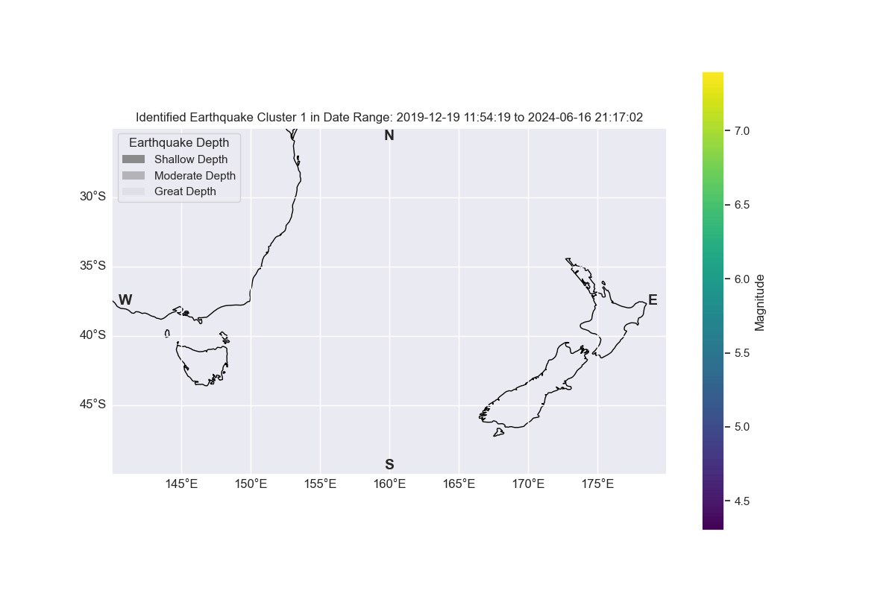

## Earthquake Cluster Animation



# New Zealand's ten most earthquake prone cities and their earthquake event forecast.  

### Project Overview
Objective: This project aims to analyse a 24 year spanning historical earthquake dataset (2020-01-01 to 2024-06-16) obtained from geonet.org.nz/ and create a model to identify the 10 most earthquake towns / cities in New Zealand and predict the timing of the next earthquake eventy for these population centers. 

Context: Earthquake prediction is a complex and challenging task due to the inherent unpredictability of seismic activity. The dataset involves a vast range of magnitudes, depths, and locations, making it difficult to identify patterns and anomalies. Additionally, the impact of aftershocks and varying local geological conditions further complicate the analysis. The lack of a universally accepted method for clustering and identifying related seismic events adds another layer of difficulty.

Significance: Accurate earthquake predictions, especially in the context of New Zealand, are crucial for disaster preparedness and mitigation. By identifying the most earthquake-prone areas and predicting potential future events, authorities can improve emergency response plans, allocate resources more effectively, and enhance public safety. This project also contributes to the broader field of seismology by providing insights into seismic patterns and potentially improving existing prediction models.

Goal: The ultimate aim of the project is to enhance our understanding of seismic activity in New Zealand, identify the towns and cities most affected by earthquakes, and predict the timing of future major events. This information will help prioritize areas for more detailed investigation and improve detection accuracy, ultimately contributing to better disaster management and public safety strategies.

## Team Members

- Dr. Benjamin Läuchli: [GitHub](https://github.com/benjaminlaeuchli)

## Jupyter Notebooks

This project consists of 3 Jupyter Notebooks that serve different purposes:

1. **Prep_Mod_MergeFile.ipynb**: 
This notebook focuses on preparing, modifying, and merging the used data sets to one compound dataset that is used for the EDA and machine learning approaches in notebooks 2 and 3.
The dataframe preparation includes a cKD-driven (scipy.spatial) cluster analysis to group the earthquakes time series by their recorded coordinates (latitude / longitude) and depth with respect to the nearest population center. This includes calculating the distance between the nearest town and respective earthquake under consideration of lateral distance and depth of the event.    

2. **EDA_Data_Visualisation.ipynb**: 
This notebook focuses on Exploratory Data Analysis (EDA) and visualisation of key aspects of the compiled dataset. It includes (i) investigating number of NZ MMI type occurrences, (ii) counting number of quakes (NZ MMI grouped) as line plots, (iii) exploring Earthquake Magnitude vs Depth, (iv) grouping the data by year and magnitude type and count the number of Earthquakes, (v) a interactive scatter plot of spatial-temporally clustered earthquake data with dropdown menu function, (vi) an interactive tempo-spatial graph with earthquake frequency per cluster plotted against measured magnitudes controlled by a dropdown menu. 


4. **Quake_Predict.ipynb**:
This notebook focuses on establishing a top 10 list of cities most likely to experience a major earthquake event uisng an isolation forest prediction model. Based on the outcome of the forecast year to next likely earth quake event are calculated. These results are set into context of the geographical distribution of populations centers, major earthquakes, and average population density on the North- and South Islands.

...

## Installation and Setup

To set up the project locally, follow these steps:

1. Clone the repository:
```
https://github.com/benjaminlaeuchli/NZ_Earthquake_Forecast.git
```
2. Navigate to the project directory (replace NZ_Earthquake_Forecast with the name of your local directory if you chose a different one):
```
cd NZ_Earthquake_Forecast
```
3. Install the required dependencies:
```
Enter the below pip install commands in your terminal or command line to install the libraries used in the provided jupyter notebooks:

pip install scipy
pip install hdbscan
pip install scikit-learn
pip install matplotlib
pip install cartopy
pip install ipywidgets

```
4. Download the provided datasets and place them in the project directory. The original dataset can be acquired from the link geonet.org.nz/ (see below for details).

5. ...

**Note:** If any of the above files are missing, the corresponding functionality may not work as expected.


## Dataset

The earthquake data was downloaded from https://geonet.org.nz/ and spans the timeframe from 01-01-2000 to 16-06-2024.
A dataset with New Zealand's towns was downloaded from https://simplemaps.com/data/nz-cities

## Attribute Information

The dataset 'df_quake_cty' used for most of the EDA is the product of merging the two above datasets after various pre-processing steps
from the above. It contains the following attributes:

1. Time
2. Unixtime
3. Longitude
4. Latitude
5. Magnitude
6. Magnitude Type
7. Depth
8. NZ_MMI
9. Adjusted Distance
10. Nearest City
11. Population
12. Cluster

Note: NZ_MMI stands for "New Zealand Mercalli Modified Intensity" scale

The dataset 'df_major_quakes' used for the machine learning prediction and parts of the EDA is a variant of 'df_quake_cty' which is reduced to all identified earthquake clusters that at least contain one major earthquake equal to over the magnitude 5. 


## Cleaning/EDA

Data Loading:
Loaded the earthquake dataset from [https://www.geonet.org.nz/].
Previewed the dataset to understand its structure and contents using head() and dtypes() functions. The relevant population centers used for this approach, including their coordinates, and population density were downloaded from [https://simplemaps.com/data/nz-cities] and merged to the earthquake dataset. 


Data Summary:
Generated summary statistics using describe() to understand the central tendency, dispersion, and shape of the dataset’s distribution.
Checked for missing values and data types for each column.

Data Visualization:
Plotted histograms plots to visualize the distribution of numerical features such as the total number of earthquakes (grouped according to NZ MMI), magnitude variability through time with regards to NZ MMI grouping, quake magnitude vs. depth.
Furthermore, an interactive scatter plots was created to visualize patterns of earthquake clusters through time which supported by a interactive histogram to depict the temporal distribution of the identifed quake clusters.

Data Cleaning
Handling Missing Values: 

Wasn't needed as NaN only found in irrelevant columns. These were simply removed from the dataset ciompletely

Data Transformation:
Converted date and time columns to datetime format for better time series analysis.

Outlier Detection and Handling:
Outliers (only relevant for magnitude vs. depth) were not removed or dealt with as they were considered (domain knowledge) to harbor potential insights into earthquake occurance patterns.

Feature Engineering:
Establishment of earthquake clusters via ST-DBSCAN as the earthquake dataset consisting of individual meassurements with no earthquake event allocation. 
To efficiently find the nearest city / town we need to not only consider lateral locations (longitude / longitudes) but also depth a cKD tree was created.

Data Filtering:
Filtered for all datapoints with magnitudes => 5 to meet the requirement of finding impactfulevents with potentially harmful consequences for human life and infrastructure.


## Model Choices

For the identification of the 10 most earthquake prone towns / cities in New Zealand and prediction of which town is most likely to experience a magnitude =>5 this project uses an isolation forest model.

The decision to chose an isolation forest  was driven by the following factors:
- Anomaly detection capabilities: Earthquakes, especially significant ones, are relatively rare events compared to the background seismic activity. Isolation Forest is inherently designed to detect outliers in data. The isolatin forst algorithm works by isolating observations by randomly selecting a feature and then randomly selecting a split value between the maximum and minimum values of the selected feature. The logic is that outliers are easier to isolate because they reside in sparse regions of the data space
- Handling high-dimensional data: Seismic data can be high-dimensional, encompassing features like latitude, longitude, depth, magnitude, time, and other geological parameters.  Isolation Forest can efficiently handle high-dimensional data without extensive preprocessing, making it suitable for complex datasets like those in earthquake studies.
- Scalibilty: Our dataset contains 519464 data points and the isolation forests is known for its scalability and can handle large datasets efficiently
- Unsupervised learning: Labeling earthquakes as normal or abnormal events can be challenging due to the lack of clear distinctions in many cases. As an unsupervised learning algorithm, Isolation Forest does not require labeled data for training, making it ideal for scenarios where labeled data is scarce or ambiguous.
- Robustness to noise: Seismic data can be noisy, with numerous minor events that may not be relevant to the study of significant earthquakes. The Isolation Forest model is robust to noise, as it focuses on isolating anomalies rather than fitting to the bulk of the data, thereby reducing the impact of noisy data points.

## Results

For my prediction I use the following metrics:
- 'Population Density' for the purpose of risk assessment and resource allocation
- 'Count of Major Events' for the analysis of earthquake frequencies and trebd identification
- 'Average Magnitude' to assess the severity and to characterize the events

The results show a dissonace between the ranking of the 10 most earthquake pronbe towns / cities and the prediction of when these population centers will be affected by a major earthquake:

  Isolation Forest Output (Count of Major Events): This ranking is based on the count of major anomalies detected in the dataset. Cities   with a higher number of detected anomalies are considered more prone to earthquakes based on historical data. Note: Isolation Forest     Ranking evaluation ranks cities based on the frequency of major anomalies detected.

  Years Until Next Major Earthquake: This prediction is based on the average interval between major earthquakes for each city and the      date of the last detected major earthquake. A city might have fewer major events historically but a shorter average interval between     those events, leading to a prediction of a sooner next major earthquake. Note: "Years Until Next Major Earthquake" evaluation predicts   when the next major earthquake is likely to occur based on the historical intervals between ma

## Prediction Function

Scripts Run During the Prediction Process
Filtering and Sorting Earthquake Events:

- Extract major earthquake events based on magnitude and anomaly.
Sort events by time.

- Calculate time intervals between successive major earthquakes for each city.

- Compute average time intervals between major earthquakes for each city.

- Identify the last major earthquake date for each city.

- Merge average intervals with last earthquake dates.

- Predict the next major earthquake date and calculate the number of years until then.

Filtering Results:

- Filter predictions to show only the top 10 cities.
- Geographical Distribution Analysis
- Additionally, the script classifies towns as being on the North or South Island, counts the number of towns and major earthquakes on each island, and calculates their proportions

## Final Remarks

Accurate predictions save lives, protect vital infrastructure, and are essential to mitigate the affects of disruptive major earthquakes.
Historic data alone clearly not sufficient for predictive earthquake modeling. To further optimize the prediction accuracy of this model, we need information regarding pressure build ups along the full length of the subduction zone, include documented patterns of shifts in seismic wave speed as well as observed patterns of shifting groundwater tables and flow direction.


